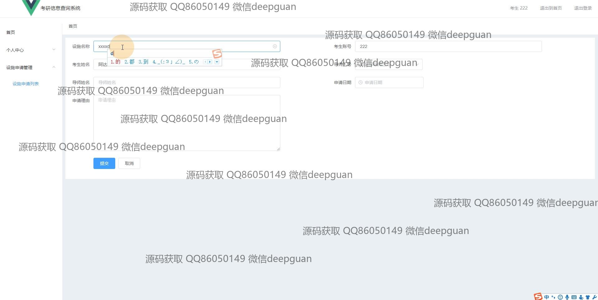

<h1 align="center">考研信息查询系统vue</h1>

## 简介
考研信息查询系统：角色分为管理员、导师、考生；支持用户注册、信息检索、设备申请管理、考研资讯管理、学校和导师信息展示、论坛交流。    --计算机毕业设计源码；毕设源码；java毕业设计源码

## 联系方式

<h3 align="center">获取完整代码与数据库文件 + 微信：deepguan QQ: 86050149 QQ群: 783742310</h3>

<h3 align="center">可帮忙远程部署 包运行成功！提供远程部署、修改代码、设计文档指导、代码讲解等服务！</h3>

## 功能介绍（完整见运行截图）
管理员：基本功能包括登录、注册和退出功能，能够管理考研资讯、专业信息、学校介绍、导师信息等。可以通过导航栏访问首页、项目详情、后台管理等模块，还能审查和管理学生的设备申请、考研成绩、和个人信息。管理员可以查看、添加、修改和删除资讯项目，以及处理用户留言和系统消息。  
导师：主要功能是通过系统查看个人信息及相关项目研究介绍信息。可以在论坛中参与交流，与学生互动，并提供指导意见。导师的信息页面会列出研究方向和项目研究背景，便于学生了解导师的学术资历和研究课题。  
学生：学生用户可以进行注册和登录，能查询与考研相关的多方面信息，包括学校介绍、专业信息、考研项目和考试安排。可申请设备并查看申请状态，管理个人信息，查看考研成绩，参与论坛交流，并向导师咨询问题。  
访客：可以通过系统访问公开的考研资讯、教育领域分类和项目研究介绍，无需注册即可浏览学校和专业信息。通过首页的导航可以快速访问各项信息内容，并了解最新的教育改革政策和考研动态信息。

## 运行截图

本代码来源于网络,仅供学习参考使用!

